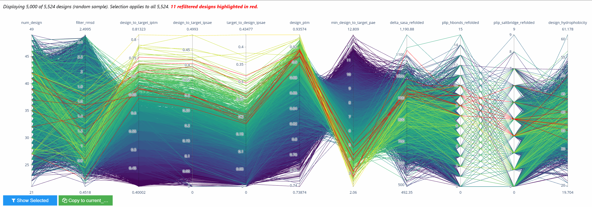

# boltzgen-view

Interactive parallel-coordinates viewer for [BoltzGen](https://github.com/HannesStark/boltzgen) protein design outputs.



## Motivation

BoltzGen's built-in plots are static scatter plots. They don't let you:

- Interactively filter and select designs across multiple metrics simultaneously
- See relationships between design features (RMSD, iPTM, ipSAE, PAE, H-bonds, delta SASA, salt bridges, etc.)
- Link selected designs directly to their predicted structures

boltzgen-view addresses this with a Plotly parallel-coordinates plot inside a Jupyter notebook. Brush any axis to filter, then open the selected structures in your viewer of choice.

## Install

```bash
conda env create -f environment.yml
conda activate boltzgen-view
```

## Usage

1. Open `notebooks/viewer.ipynb` in JupyterLab.
2. Set `design_dir` to `intermediate_designs_inverse_folded` in your BoltzGen output directory.
3. Adjust filters and thresholds as needed.
4. Run all cells. Brush axes in the parallel-coordinates plot to select designs.
5. Run the selection cell to get the filtered DataFrame and CIF paths.
6. Open the CIF files in your structure viewer (e.g. [NanoProteinViewer](https://github.com/nicholasmckinney/NanoProteinViewer) for VSCode-based viewing).
